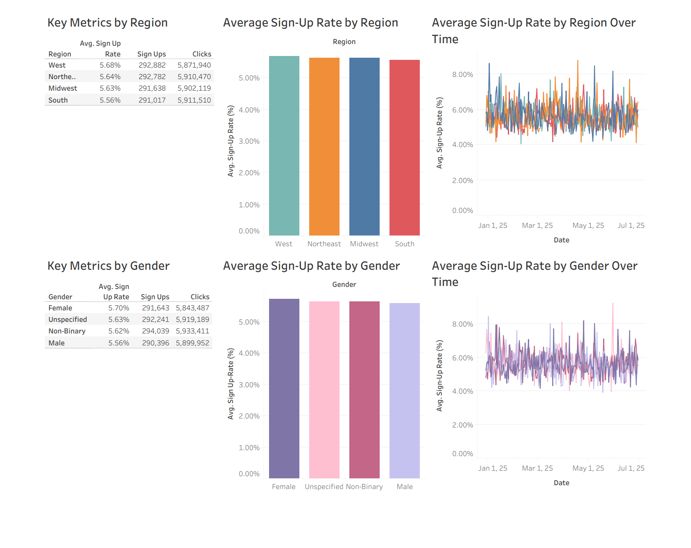

# Retail E-Commerce Marketing Analysis

## 1. Background and Overview
As a data analyst at our retail company, I was tasked with identifying areas where our e-commerce marketing efforts are falling short. Specifically, I was asked to determine which **regions** and **customer segments**, **gender** in this case, are underperforming in terms of **sign-up rate**.

This project involved cleaning (scrpit [here](https://github.com/pablo-vega-analyst/Retail-Ecommerce-Marketing-Project/blob/main/retail_ecommerece_marketing_data_cleaning.sql)) and analyzing (script [here](https://github.com/pablo-vega-analyst/Retail-Ecommerce-Marketing-Project/blob/main/retail_ecommerce_marketing_data_analysis.sql)) marketing campaign data, followed by creating a Tableau dashboard to visualize performance trends. The final recommendation helps guide our strategy toward improving **sign-up rates** for underperformaing audience segments.

## 2. Data Structure Overview
The dataset contains marketing data from our e-commerce platform, with each row representing a unique combination of campaign activity on a given date, segmented by key attributes. The columns include:

- Date: The date the campaign data was recorded.

- Channel: The marketing channel used (Email, Paid Search, Social, etc.).

- Campaign: The name of the marketing campaign.

- Region: The U.S. region where the campaign was shown (West, Northeast, Midwest, South).

- Gender: Gender of the target audience segment (Male, Female, Non-Binary, Unspecified).

- Account Status: Whether the user group has an account or not.

- Impressions: Number of times the campaign was displayed.

- Clicks: Number of times users clicked the ad.

- Conversions: Number of conversions.

- Sign-Ups: Number of users who signed up for an account.

- Emails Sent: Number of marketing emails sent for that row's campaign/channel.

- Emails Opened: Number of emails that were opened.

- Total Ad Spend: Total amount of money spent on the campaign for that row.

Additional calculated metrics include:

- **Sign-Up Rate** = Sign-Ups / Clicks

- Cost Per Sign-Up = Total Ad Spend / Sign-Ups

## 3. Executive Summary
The key business question was:
Which **regions** or **customer segments** are underperforming in terms of **sign-up rate**?

After cleaning and analyzing the data, I built an interactive Tableau dashboard that visualizes **average sign-up rates** across both **region** and **gender**, over time and in aggregate.

View the interactive dashboard [here.](https://public.tableau.com/app/profile/pablo.vega1512/viz/RetailE-commerceMarketingData/Dashboard1)

## 4. Insights Deep Dive
Here are the most notable findings:

**Regional** Performance

The **South region** had the lowest **average sign-up rate** at **5.56%**.

Other **regions** performed marginally better:

- **West**: **5.68%**

- **Northeast**: **5.64%**

- **Midwest**: **5.63%**

**Gender** Segment Performance

**Male** users had the lowest **average sign-up rate** at **5.56%**.

Other **genders** performed marginally better:

- **Female**: **5.70%**

- **Unspecified**: **5.63%**

- **Non-Binary**: **5.62%**

## 5. Recommendations
The **region** and **gender** that have the lowest **average sign-up rates** are the **South region** and **males**, but the **average sign-up rates** of both of these customer segments are only lower than their top-performing counterparts by one tenth and two tenths of a percent, respectively. My recommendation would be to work with the marketing team, investigate marketing campaigns aimed at the **South region** and **male** users, and see if there is room to adjust ads in a way that is more compelling to these audience segments.
